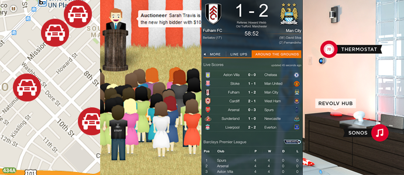
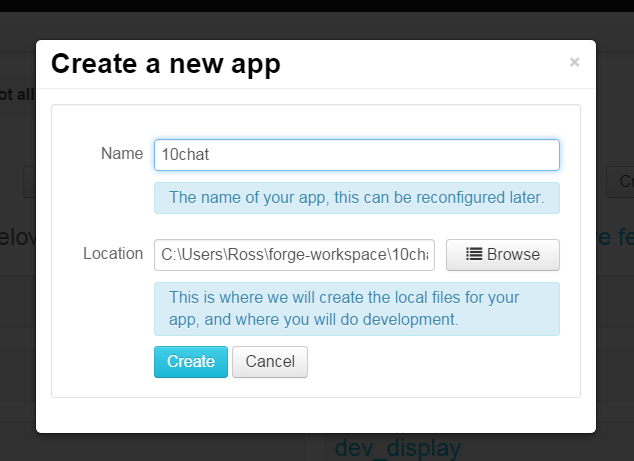
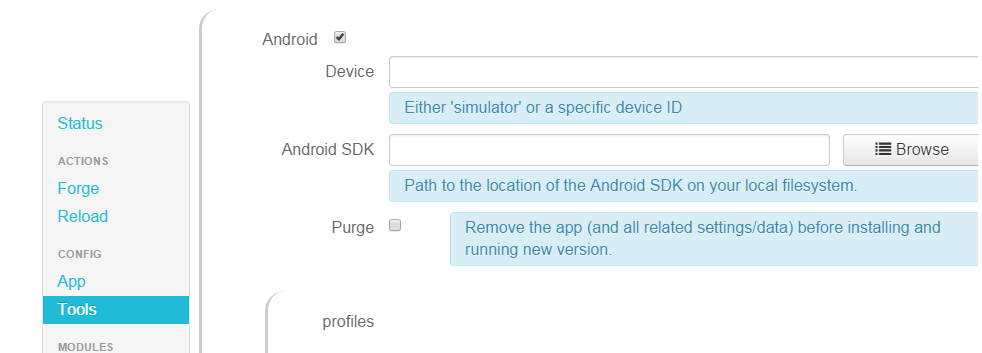
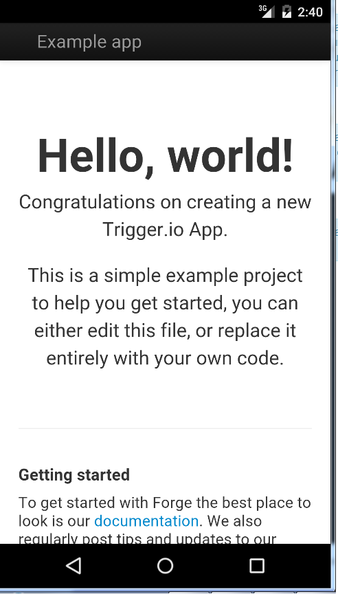
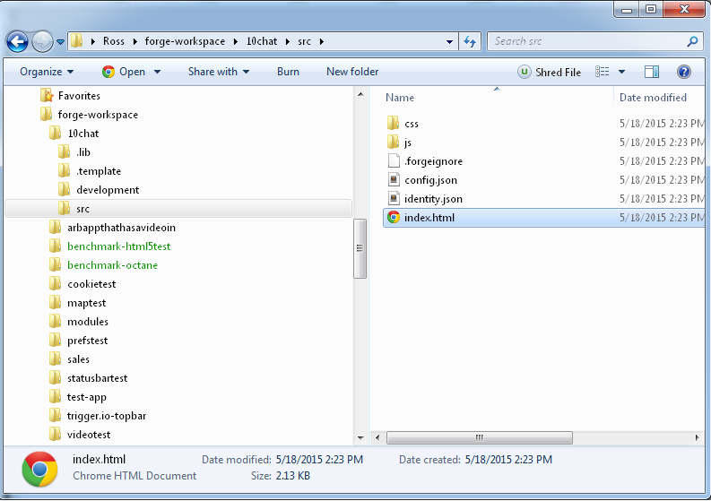
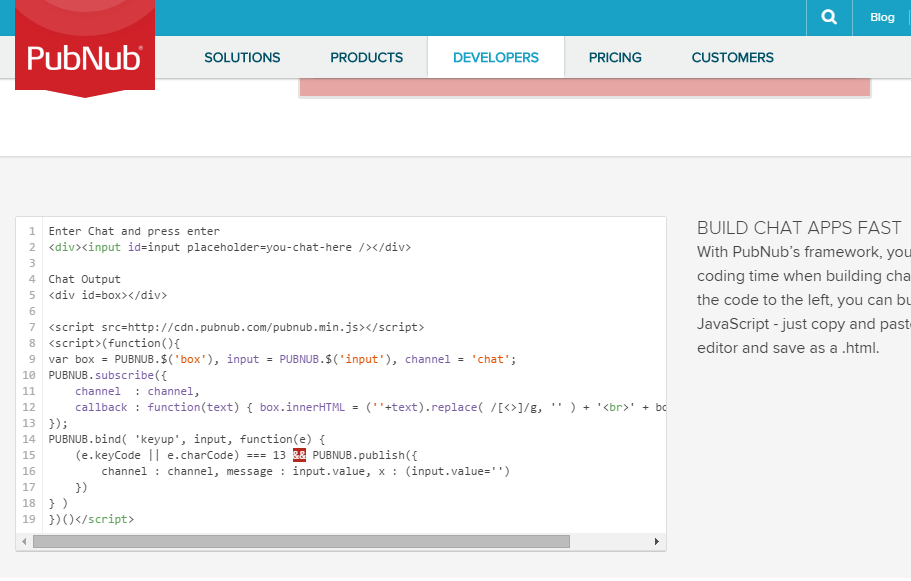
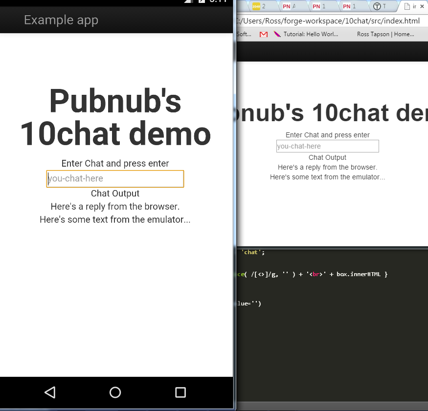

##Everything's connected to everything else.##

It's a fascinating time to be a developer. As early as 2008 the number of things connected to the internet surpassed the number of people alive on earth, and some well informed people think the number<a href="http://www.cisco.com/web/about/ac79/docs/innov/IoT_IBSG_0411FINAL.pdf"> could be as high as 50 billion by 2020</a>.

 Users have been exposed to the type of user experience that realtime web technology provides, and expect those types of experiences in the apps that they use. Although realtime web technologies have been around for some time it's only quite recently they've started to pervade everyday activities, such as <a href="http://zoomy.co.nz/"> hailing a taxi </a>, keeping track of <a href="https://www.sportlobster.com/">sports scores</a>, bidding in an <a href="http://tophatter.com/">online auction</a> or even <a href="https://nest.com/">opening the door to the garage</a>. 

###Keep talking###

 
Massive social platforms now represent one of the main ways that we communicate with each other. It's realtime technologies that power the interactivity that make the experience so rewarding. Given the comprehensive toolsets provided by Pubnub, implementing full-featured, massively scalable chat and messaging has never been easier. 

###IoT and Really Big Numbers&trade;###

Talk about the Internet of Things brings up numbers that get management types sweaty. The global market is <a href="http://www.nerdgraph.com/rise-internet-things/">estimated to be worth $7.1 trillion</a> by by 2020, or $14.4 trillion, according to <a href="http://www.psfk.com/2014/03/internet-of-things-infographic.html">Cisco</a>. Less than 1% of things that could be connected to the Internet currently are, which means 10 billion things out of the 1.5 trillion that exist globally are currently connected. That's a big gap, and a big opportunity.

Time-to-market has never been more key, nor a mature and well-developed technology stack. <a href="https://www.pubnub.com/">Pubnub</a> started life as a provider of APIs that allowed publishers and developers to integrate messaging and social services on apps and websites and now offers PubNub Data Stream Network, 'Platform-as-a-solution' that allows rapid development of real-time apps and communication for web, mobile and IoT apps. The wide range of robust, friendly APIs merge seamlessly with <a href="https://trigger.io/">Trigger.io's</a> fast, effective hybrid mobile dev model, bringing realtime technology to mobile.

###Pubsub###

In software architecture, **publish–subscribe** is a messaging pattern where senders of messages, called *publishers*, do not program the messages to be sent directly to specific receivers, called *subscribers*. Instead, published messages are characterized into classes, without knowledge of what, if any, subscribers there may be. Similarly, subscribers express interest in one or more classes, and only receive messages that are of interest, without knowledge of what, if any, publishers there are.

Pub/sub is a sibling of the message queue paradigm, and is typically one part of a larger message-oriented middleware system. 

This pattern provides greater network scalability and a more dynamic network topology, with a resulting decreased flexibility to modify the Publisher and its structure of the data published.

###Incorporating PubNub into Trigger.io###

To demonstrate Pubnub's ease of use we've incorporated <a href="http://www.pubnub.com/developers/demos/10chat/">10chat</a>, a simple 10-line javascript chat app into a Trigger.io app, as follows:

1. In the Trigger Toolkit, create a new app.
 
2. Under `Config / Tools`, specify whether you want the app to run on a specific device or emulator, and specify the path to the appropriate SDK 
3. Now let's give it a test run! Under `Forge`, click either `Android` or `iOS` to run it on the appropriate platform, or click `Web` to run it in a browser window.
4. You should see something like this:
5. So far so good. Now let's make it do something. Find the `index.html` file in the /src folder under you app folder, and open it in the text editor of your choice.
6. Remove everything from line 44, `<h1>Hello, world!</h1>`, to line 59, `
`.
7. Click <a href="http://www.pubnub.com/developers/demos/10chat/">here</a> to go to PubNub's 10chat demo page, and select and copy the 10chat javascript code from the code box. 
8. Paste it into `index.html` in place of the markup you removed.
9. Save the file, go back to the Trigger Toolkit and run the app again. 
10. Open the index.html in a browser page, and chat back and forth between the two.
11. Profit!